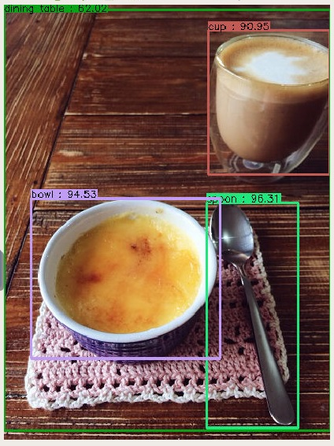

# CPPND : Capstone Project
## Object Detection with SSD MobileNet in C++

## Overview
I implemented the object detection model using OpenCV. The Deep Neural Network model I employed here is SSD(Single Shot MultiBox Detector) with MobileNet. This program reads an image file, which could be a single photo or a movie, and performs object detection, then shows the image with indicators(box for the object detected, category name, and confidence(%)). This model can detect 90 categories of objects (listed in [`model/object_detection_classes_coco.txt`](model/object_detection_classes_coco.txt)).

I was interested in making programs in which Deep Learning techinques are used by C++, so I decided to build this project as my capstone project(free theme) in [C++ Nanodegree at Udacity](https://www.udacity.com/course/c-plus-plus-nanodegree--nd213). After experiments with prototypes, I realized performing object detection through the network would be computationally expensive, which made the movie stop at every frame to play and made it very slow. To solve this problem, I created a thread which execute object detection in an independent time order from the main thread. The most challenging part was to get the result of detection and draw it on the right frame without interupting the movie.

## Structure

### Outline
This program firstly takes command line options specified by the user and sets them to inner variables.

It launches a thread which reads frames of the movie from the image file (if it's a photo, just one frame). In this thread, frames being read are sent to "image queue", as well as to "detection queue" once in a certain number of frames. This happens in `Graphic` class.

Then the other thread is launched in `SSDModel` class, which obtains an image data from "detection queue" and performs object detection. The result is stored in a queue inside the class.

After, in the main thread, image data in "image queue" is retrieved one by one. In that loop, once in a certain number of frames the result of the detection is updated by popping from the queue in `SSDModel`. The result of the detection is drawn on the image data. The image is shown in a window.

### Files and Classes
- `main.cpp`: Includes `main()` function.
 - Takes command line options and set parameters into inner variables.
 - Creates `image_queue` and `detection_queue`, create `SSDModel` object and `Graphic` object, and call functions in both objects which launch threads.
 - In a loop, it reads image data from the queue, get the result of detection, draw it on the image and show.

- `Graphic.h` `Graphic.cpp`: Define `Graphic` class.
 - Launch a thread which reads the image file
 - Draw the result of detection on the image
 - Store information about the image

- `SSDModel.h` `SSDModel.cpp` : Define `SSDModel` class.
 - Load the DNN model
 - Launch a thread which performs object detection
 - Store the result of detection in a queue, and retrieve it

- `MessageQueue.h` : Define `MessageQueue` class.
 - Holds a queue, and provides functions to send and receive frames using the queue.
 - Provides functions which sends and receives the total number of frames sent

## Contents
This repository contains:
- `src/` : Source files listed above
- `model/` : Files for the DNN model
 - SSD MobileNet model file : `frozen_inference_graph.pb` (download *ssd_mobilenet_v2_coco* from [here](https://github.com/tensorflow/models/blob/master/research/object_detection/g3doc/detection_model_zoo.md))
 - SSD MobileNet config file : `ssd_mobilenet_v2_coco_2018_03_29.pbtxt` (download from [here](https://github.com/opencv/opencv_extra/tree/master/testdata/dnn))
 - class file : `object_detection_classes_coco.txt` (download from [here](https://github.com/opencv/opencv/tree/master/samples/data/dnn))

- `images/` : Sample photos and videos to test the program
- `result/` : Examples of output images
- `CMakeLists.txt` : cmake configuration file
- `README.md` : This file

## Requirements
- **OpenCV >= 4**
  - [Install instruction for Linux](https://docs.opencv.org/4.1.1/d7/d9f/tutorial_linux_install.html)
  - [Install istruction for Windows](https://www.learnopencv.com/install-opencv-4-on-windows/)
  - [Install instruction for Mac](https://www.learnopencv.com/install-opencv-4-on-macos/)
- cmake >= 3.7
    * All OSes: [click here for installation instructions](https://cmake.org/install/)
- make >= 4.1 (Linux, Mac), 3.81 (Windows)
    * Linux: make is installed by default on most Linux distros
    * Mac: [install Xcode command line tools to get make](https://developer.apple.com/xcode/features/)
    * Windows: [Click here for installation instructions](http://gnuwin32.sourceforge.net/packages/make.htm)
- gcc/g++ >= 5.4
    * Linux: gcc / g++ is installed by default on most Linux distros
    * Mac: same deal as make - [install Xcode command line tools](https://developer.apple.com/xcode/features/)
    * Windows: recommend using [MinGW](http://www.mingw.org/)
- **GPU** is recommended

## Build
In the root directory (this repository), execute the command below:
1. `mkdir build`
2. `cd build`
3. `cmake ..`
4. `make`

The executable(`ssd_obj_detect`) is created in the current directory(`build`).

## Run
In `build` directory, run the executable like below:

`./ssd_obj_detect [options] <image file>`

This reads an image file and show the result of object detection. `<image file>` should be a path to the file you want to input.

#### Options
 - `-c` : specifies *confidence threshold* between 0 and 1.0. If omitted, default value is 0.5. (example: `-c=0.3`)
 - `-n` : specifies the threshold used for *Non-max Suppression* between 0 and 1.0. If omitted, default value is 0.5. (example: `-n=0.7`)
 - `-h` `-?` `--help` `--usage`: Show usage.

#### Example

`./ssd_obj_detect -c=0.3 ../images/bunnings.JPG`

## Reference
This program is inspired by this sample implementation:

https://github.com/opencv/opencv/blob/master/samples/dnn/object_detection.cpp
